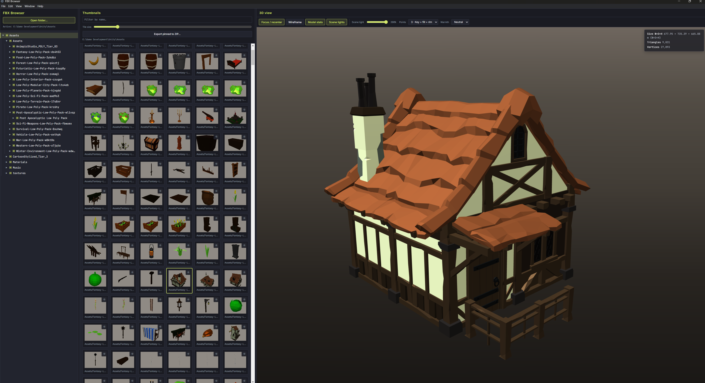
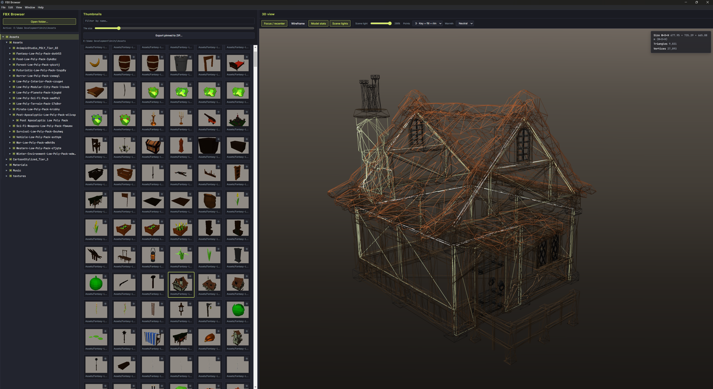
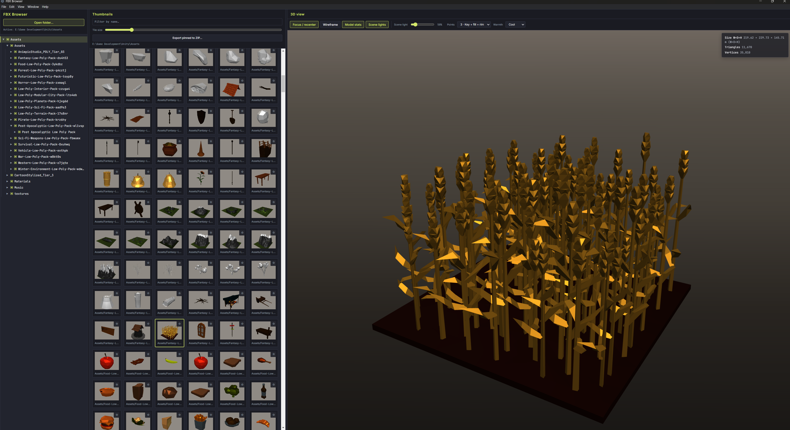
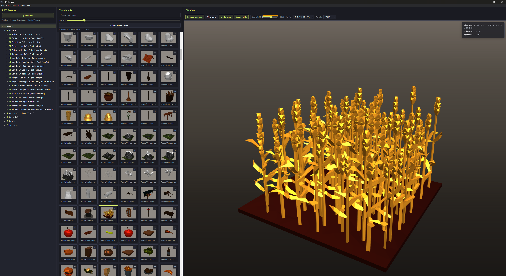
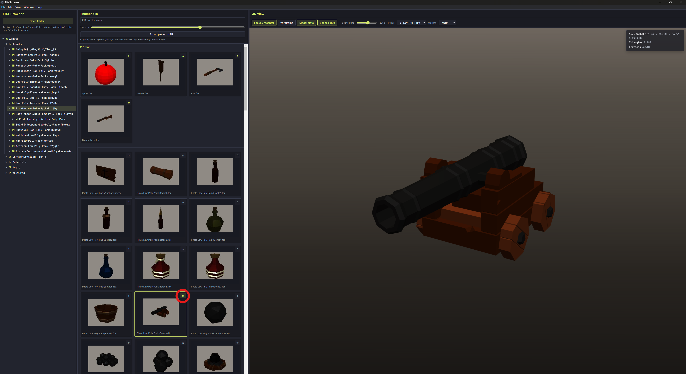
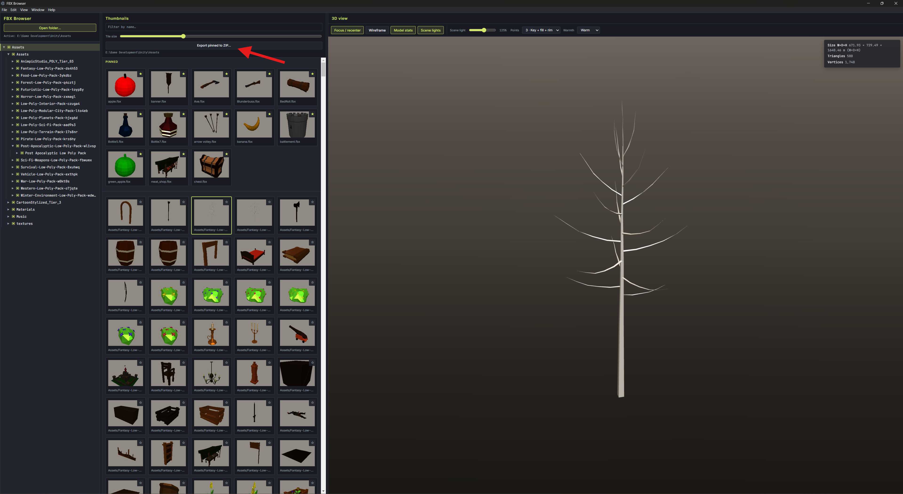

# FBX Viewer

A small **Electron** desktop app for opening folders of **FBX** files, previewing them in a **3D viewport**, and collecting models you care about for use elsewhere (for example in a game engine).

## Screenshots

### 1. View 3D models

Select a folder, click a thumbnail, and the model opens in the **3D view** on the right. Drag to orbit, scroll to zoom, and use right-drag to pan.



### 2. View model as wireframe

Click **Wireframe** in the 3D toolbar to inspect mesh topology and edge flow without full shading.



### 3. Change lighting (dim and bright)

Use the **Scene light** slider (and **Scene lights** / **Ambient only** if you need a flatter look) to compare dark and bright lighting on the same asset.

*Dim lighting (lower intensity).*



*Bright lighting (higher intensity).*



### 4. Add models to favorites

Click the **star** on a thumbnail to **pin** a model. Pinned files appear in the **Pinned** section so you can get back to them quickly.



### 5. Export favorites to a ZIP file

**Export pinned to ZIP…** (in the Thumbnails panel) packages every pinned `.fbx` into a single archive—handy for copying assets into a game or engine.



## What you can do

- **Open a folder** — Pick any directory on disk. The app builds a tree on the left and lists every `.fbx` under that root (recursively) as thumbnails in the middle column.
- **Preview models** — Click a thumbnail to load the file in the **3D view** on the right. Orbit with the mouse (rotate, zoom, pan) like a typical 3D viewer.
- **Pin favorites** — Use the star on a thumbnail to **pin** models you want to keep handy. Pinned items are stored in the app (local storage) and shown in a **Pinned** section at the top of the thumbnail list.
- **Export pinned models** — **Export pinned to ZIP…** saves all currently pinned `.fbx` files into a single ZIP you can unpack in your game project. If two files share the same name, the archive renames duplicates (e.g. `Model (2).fbx`).
- **Inspect the mesh** — Toggle **Model stats** to see bounding box size (W×D×H), triangle and vertex counts.
- **Adjust the view** — **Focus / recenter** fits the model in view, **Wireframe** toggles wireframe shading, and **Scene lights** / intensity / warmth control how the model is lit.
- **Animations** — If the FBX includes animation, basic **Play** / **Pause** controls appear when applicable.

## Run from source

1. Install [Node.js](https://nodejs.org/) (LTS is fine).
2. In this folder:

   ```bash
   npm install
   npm start
   ```

   With **Yarn**: `yarn` then `yarn start`.

## Build a distributable

After `npm install` (or `yarn`), use [electron-builder](https://www.electron.build/) via `package.json` scripts. **Yarn** works the same way: `yarn dist`, `yarn dist:win`, `yarn dist:all`, and so on.

| Command | Output |
|--------|--------|
| `npm run pack` | Unpacked app under `release/` (quick test) |
| `npm run dist` | Package for **your current OS** |
| `npm run dist:win` | Windows (NSIS installer + portable, x64) |
| `npm run dist:mac` | macOS DMG + zip (run on macOS) |
| `npm run dist:linux` | Linux AppImage + deb (run on Linux) |
| `npm run dist:all` | **macOS:** Windows + Linux + macOS (see [multi-platform](https://www.electron.build/multi-platform-build)). **Windows:** Windows only (build Linux artifacts on Linux or CI). **Linux:** Windows + Linux (Windows output may need Wine). |

Build output goes to the **`release/`** directory.

`package.json` sets **`forceCodeSigning`: false** so local builds are **not** code-signed. For store or signed releases, set up credentials in CI and turn signing on per [electron-builder’s docs](https://www.electron.build/code-signing).

## Notes

- Pinned paths are **absolute file paths**. If you move or rename files on disk, pins may break until you re-open the folder and pin again.
